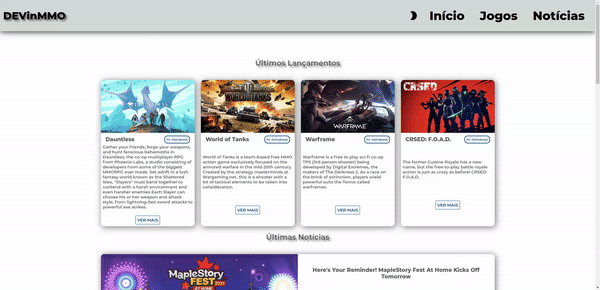

# Projeto 02 DevinHouse
---

Este repositorio foi criado para adicionar o projeto 02 desenvolvido no curso DevinHouse.

- [Projeto DEVinMMO OnLine esta aqui.](https://devinmmo.netlify.app/)

	
   
  

  <a href="https://github.com/meirelesdev/devinmmo/commits/main">
    

# :pushpin: Índice

- [Sobre](#sobre)
- [Tecnologias Utilizadas](#tecnologias-utilizadas)
- [Imagens](#imagens)

## :bookmark: Sobre

O <strong>Projeto DEVinMMO</strong> é o segundo projeto da Turma teltec e BRy do Dev in House, desenvolvido para teste e pratica dos conhecimento aprendidos na primeira parte do curso e tem o objetivo de avaliar o aluno e possui o peso de 40% sobre a avaliação do módulo 1.

## :rocket: Tecnologias Utilizadas

O projeto aqui disposto foi desenvolvido utilizando as seguintes tecnologias:

- [HTML](https://www.w3schools.com/html/default.asp)
- [CSS](https://www.w3schools.com/css/default.asp)
- [JAVASCRIPT](https://www.w3schools.com/js/default.asp)
- [ReacJS](https://pt-br.reactjs.org/)

## :bookmark: Imagens
### Layout Responsivo

### Loading...

### Troca de Thema
---

### Busca em tempo Real.
---

### SlideShow

<h4 align="center">
    Feito com ❤️ by <a href="https://www.linkedin.com/in/developer-danielmn/" target="_blank">Daniel Meireles</a>
</h4>